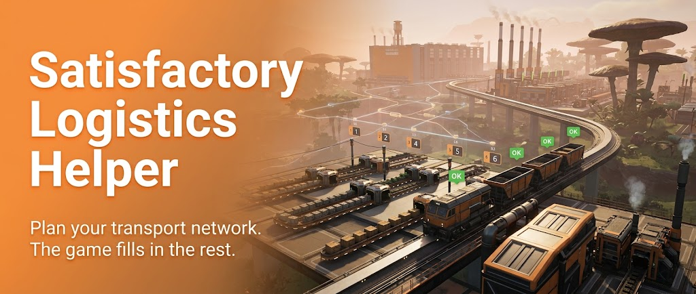

# Satisfactory Logistics Helper

Plan and check the freight network of your Satisfactory factory in a
self-hosted [Grist](https://www.getgrist.com/) spreadsheet. The game itself
fills in your stations and platforms: a small sync service reads
them from the **Ficsit Remote Monitoring (FRM)** mod. You only enter what
the game cannot know: **which product goes where, and how much**.

> **Requirement:** the [Ficsit Remote Monitoring](https://ficsit.app/mod/FicsitRemoteMonitoring)
> mod must be installed and its web server running. Without FRM you would have to maintain
> every station and platform by hand, which defeats the purpose of this tool.

---

## Contents

- [Quick start](#quick-start)
- [How it works](#how-it-works)
- [What is automatic, what is manual](#what-is-automatic-what-is-manual)
- [Daily use](#daily-use)
- [Pages](#pages)
- [Checks and what they mean](#checks-and-what-they-mean)
- [How the game is mapped](#how-the-game-is-mapped)
- [Installation](#installation)
- [Configuration](#configuration)
- [Operation](#operation)
- [Limitations](#limitations)
- [License](#license)
- [Disclaimer](#disclaimer)

---

## Quick start

You need: Satisfactory with the [Ficsit Remote Monitoring](https://ficsit.app/mod/FicsitRemoteMonitoring)
mod, and [Docker Desktop](https://www.docker.com/products/docker-desktop/) (Windows/macOS) or Docker (Linux).

1. **Game:** start Satisfactory, load your save, start the FRM web server.
2. **Start it:**
   ```bash
   git clone https://github.com/Gunsi1973/satisfactory-logistics-helper.git
   cd satisfactory-logistics-helper
   cp .env.example .env        # Windows: copy .env.example .env
   docker compose up -d
   ```
3. **API key:** open <http://localhost:8484>, click **Sign in**, then avatar →
   **Profile Settings → API → Create**. Paste the key into `.env` as
   `GRIST_API_KEY=...` and run `docker compose up -d` again.
4. **Done.** Within a few seconds the document **Satisfactory Logistics
   Helper** appears in Grist, filled with your stations. Add deliveries, see
   [Daily use](#daily-use).

Stations don't show up? Run `docker logs satisfactory-frm-sync`. If it says
*FRM not reachable*, see [Networking](#networking).

---

## How it works

In Satisfactory a train's wagon order lines up with a station's freight
platforms: wagon 1 stops at platform 1, wagon 2 at platform 2, and so on. A
product loaded on **platform 3** at one station can therefore only be
unloaded on **platform 3** at the destination. This tool is built on that rule:

- A **slot** is a freight platform. It is either **Load** (export) or
  **Unload** (import) and carries exactly **one product**.
- A **delivery** connects a Load slot to a destination station. The unload
  slot is always the **same slot number** at the destination, so the tool
  picks it for you.
- Every few minutes the sync service compares your plan with the game and
  flags anything that doesn't match.

**Drone ports** work the same way with two fixed slots: **slot 1 = send**
(the port's outgoing inventory, Load) and **slot 2 = receive** (incoming
inventory, Unload). A drone delivery always goes from slot 1 of one port to
slot 2 of the port its drone flies to. Which port that is comes from the game.

```
 Game (FRM mod) ──► frm-sync ──► Grist ◄── you (deliveries, amounts)
   stations,          every        plan + checks
   platforms,         2 min
   drone ports,
   trains
```

---

## What is automatic, what is manual

| Data | Automatic (from the game) | Manual (you) |
|---|---|---|
| **Stations** (train stations and drone ports) | Created, updated, retired. Name, type, number of platforms, "in game" flag, last seen. Drone ports: destination port of its drone, whether a drone is built | Note |
| **Slots** (platforms) | Created for every platform, any number per station; always 2 per drone port. Slot number, Load/Unload mode, current content and stock | Amount per minute (production for Load, demand for Unload), note |
| **Load product** | Set as soon as the platform contains exactly one product. Kept when the platform runs empty | Only for a platform that has **never** held anything (pre-fill it) |
| **Unload product** | Derived from the deliveries going to that slot | – |
| **Deliveries** | Destination slot (trains: same slot number at the destination; drones: slot 2) | **Source slot, destination station, amount per minute**, train (optional), note |
| **Products** | New product names seen in the game are added | – |
| **Trains** | Name, timetable, current stop, cargo per wagon | – |
| **Trucks, truck stations** | Listed for information: status, inventory, fuel | – (not part of the planning, see [Limitations](#limitations)) |
| **Drones** | Listed for information: home port, destination, flight status | – |

**In short:** build your stations in the game and set each platform to
Loading or Unloading. In Grist you then only add deliveries and the amounts.

---

## Daily use

### Open Grist

Go to `http://localhost:8484` and click **Sign in**. In single-user mode no
password is needed. Open the document **Satisfactory Logistics Helper**.

### A new station

You don't have to do anything in Grist.

1. Build the station in the game and give it a name.
2. Set every freight platform to **Loading** or **Unloading**.
3. Within about 2 minutes it appears on the **Train Stations** page (drone
   ports on **Drone Ports**), with one slot
   per platform.
4. For Load slots, enter the **production per minute** in *Amount/min*.

### A new delivery

1. Open the **Deliveries** page and add a row.
2. **Source (Load slot):** pick the slot that loads the product, e.g.
   `Base #3 ⬆ Automated Wiring`. Only Load slots are offered.
3. **To (destination station):** pick the station.
4. **Amount/min:** how much of the product goes there.
5. Optional: train name and a note.

The destination slot is filled in for you: the same slot number at the
destination station. If the *Check* column shows anything other than `OK`,
the game doesn't match yet, for example because that platform is still set to
Loading. Fix it in the game; the error clears on the next sync.

### A drone delivery

1. In the game, set the destination of the drone on the sending port.
2. On the **Deliveries** page add a row. **Source:** slot 1 of the sending
   port, e.g. `Base (drone port) #1 ⬆ Fused Modular Frame`.
3. **To:** the destination port. Only drone ports are offered.
4. **Amount/min** and optionally a note.

The destination slot is always slot 2 (receive). The check reports an error
if the drone of the sending port flies somewhere else in the game, or if the
port has no drone.

> **Return flights:** a drone never flies back empty. At its destination it
> picks up everything in that port's send slot and brings it home. If a port
> sends goods *and* is the destination of other drones, those drones also take
> its goods. The slot check warns about this (*return flight: …*). Planning
> return flights is not supported: keep a port either sending to its own
> destination, or receiving only.

### Demand at the destination

To see whether a station gets enough, enter the **demand per minute** in
*Amount/min* of its Unload slot. *Balance* then shows the surplus (+) or the
shortfall (−).

### A station was rebuilt, extended or moved

Nothing to do, **as long as the name stays the same**. Amounts, notes and
deliveries stay attached. Extra platforms appear as new slots.

### A station was renamed or demolished

- **Renamed:** the station shows up as a new station under its new name.
  The old entry is flagged *not in game anymore*. Move your amounts and
  deliveries over, then delete the old entry.
- **Demolished:**
  - If it has manual data (amounts, notes, deliveries), it stays and is
    flagged *not in game anymore*.
  - If it has none, it disappears on its own.

---

## Pages

| Page | What you see |
|---|---|
| **Train Stations** | Overview with one row per train station and columns Slot 1–12 (`⬆ product` = Load, `⬇ product` = Unload, `free` = no product yet). Free slots and a check per station. Selecting a station shows its slots plus its outgoing and incoming deliveries below. |
| **Drone Ports** | One row per drone port: whether it has a drone, where its drone flies (*Sends to*), which drones fly here (*Receives from*), send and receive product. Selecting a port shows its two slots and its deliveries. |
| **Deliveries** | All deliveries, trains and drones. This is where you add new ones. |
| **Slots** | All slots of all stations, with game content, amounts, balance and checks. |
| **Products** | Per product: total production, demand and transported amount, and which stations export it. |
| **Game (FRM)** | Sync status (last successful read). All vehicles: trains with timetable and cargo per wagon (wagon number = slot number), trucks with fuel and the truck station they stand at, drones with their port pairing. All truck stations and drone ports with inventory and fuel. |

Columns marked **(calculated)** are formulas. **Don't type into them.** In
Grist, editing a formula cell changes the formula for *every* row. The
editable column next to them, e.g. *Load product (game/manual)*, is the one
to change.

---

## Checks and what they mean

Problems are highlighted in red in the *Check* columns.

| Where | Message | Meaning |
|---|---|---|
| Slot | not in game anymore | The platform no longer exists, but manual data is still attached to it |
| Slot | several products in slot | The platform holds more than one product. Your belts feed a mix |
| Slot | game holds X | An Unload slot contains a different product than the deliveries bring |
| Slot | deliveries with different products | Two deliveries to the same slot carry different products |
| Slot | overbooked | Deliveries take more than the production entered |
| Slot | undersupplied | Deliveries bring less than the demand entered |
| Slot | product unknown | A Load slot has deliveries but no product yet (pre-fill it) |
| Delivery | slot N at X is set to Load in game | The destination platform must be set to **Unloading** |
| Delivery | X has no slot N | The destination station is too short for this slot number |
| Delivery | destination slot already receives Y | Another product is already being delivered to that slot |
| Delivery | source = destination | Source and destination station are the same |
| Delivery | train cannot deliver to X / drone cannot deliver to X | Train slots deliver to train stations, drone ports to drone ports |
| Delivery | drone of X flies to Y in game | The destination doesn't match the drone's destination set in the game |
| Delivery | drone of X has no destination in game / X has no drone | Set a destination or build a drone on the sending port |
| Slot | return flight: drones from X also take these goods | Drones from other ports land here and carry the send slot's goods back (see [A drone delivery](#a-drone-delivery)) |
| Station | name used N× in game | Several stations in the game share this name (see below) |

If the game is not running, nothing breaks. The sync status says *FRM not
reachable*, and all data stays at the last successful read.

---

## How the game is mapped

- **A station is identified by its type and name.** The game gives each
  station an internal ID, but that ID changes when the station is rebuilt or
  extended. Matching by name makes rebuilds seamless. A train station and a
  drone port may share a name; drone ports are shown as *Name (drone port)*.
- **Slot number** = position of the platform counted from the station
  building. The platform next to the building is slot 1. This matches the
  wagon order as long as all platforms are on the same side of the station
  building.
- **Modes:** *Loading* maps to **Load**, *Unloading* to **Unload**.
- **Drone ports:** the outgoing inventory is slot 1 (Load), the incoming
  inventory slot 2 (Unload). *Sends to* is the destination of the drone built
  on that port.
- **Duplicate station names:** the station with the most platforms is used,
  and the duplicate is flagged. Give every station a unique name.

---

## Installation

### Requirements

- Satisfactory (1.0 or later) with the **Ficsit Remote Monitoring** mod,
  installed for example with the [Satisfactory Mod Manager](https://smm.ficsit.app/)
- Docker with the Compose plugin:
  - **Windows / macOS:** [Docker Desktop](https://www.docker.com/products/docker-desktop/)
    (on Windows with the WSL 2 backend, the default)
  - **Linux:** Docker Engine with the Compose plugin
- Grist and the sync run on the PC that runs the game, or on a machine in the
  same network that can reach FRM's port `8080`

### 1. Enable the FRM web server

Start the FRM web server in the game. How depends on your FRM version, see
the mod's documentation. Check that it answers:

```bash
curl http://localhost:8080/getTrainStation
```

On Windows run this in PowerShell; use `curl.exe` instead of `curl` there.
You should get a JSON list of your stations. If Windows asks whether
Satisfactory may accept network connections, allow it for private
networks, otherwise Docker cannot reach FRM.

### 2. Get the files

```bash
git clone https://github.com/Gunsi1973/satisfactory-logistics-helper.git
cd satisfactory-logistics-helper
cp .env.example .env
```

On Windows use `copy .env.example .env`. On Linux also run `mkdir -p persist`.

### 3. Start the stack

```bash
docker compose up -d
```

Open `http://localhost:8484` and click **Sign in**.

### 4. Create an API key for the sync

In Grist click your avatar (top right), then **Profile Settings → API →
Create**. Copy the key into `.env` as `GRIST_API_KEY`.

### 5. Start the sync

```bash
docker compose up -d
docker logs -f satisfactory-frm-sync
```

On the first run the sync imports `template/satisfactory-logistics-helper.grist`
as the document **Satisfactory Logistics Helper**. Later runs find it by name.
To use a different document, set its ID as `GRIST_DOC_ID` in `.env`.

Expected output:

```
Start: FRM http://host.docker.internal:8080 -> Grist http://satisfactory-grist:8484, interval 120s
Created document 'Satisfactory Logistics Helper' from template: http://localhost:8484/o/docs/...
New stations: ...
OK: 3 stations, 16 platforms, 2 trains (16 new slots)
```

If you see `FRM not reachable`, check that the game is running with the FRM
web server, then check your firewall (see [Networking](#networking)).

---

## Configuration

All settings live in `.env`:

| Variable | Default | Purpose |
|---|---|---|
| `GRIST_TAG` | `1.7.20` | Grist image version (pinned on purpose, Grist migrates its database on start) |
| `TZ` | `Europe/Zurich` | Time zone for timestamps |
| `GRIST_BIND` | `127.0.0.1` | Address Grist listens on. Set your LAN IP to reach it from other devices. **Grist runs without login, so everyone who can reach it has full access.** |
| `GRIST_PORT` | `8484` | Grist port |
| `GRIST_DEFAULT_EMAIL` | – | Identity used for "Sign in" in single-user mode |
| `PYTHON_TAG` | `3.13-alpine` | Image for the sync service |
| `FRM_URL` | `http://host.docker.internal:8080` | FRM web server, seen from inside the container |
| `SYNC_INTERVAL` | `120` | Seconds between two syncs |
| `GRIST_DOC_ID` | empty | Optional. Empty = use or create the document *Satisfactory Logistics Helper* |
| `GRIST_API_KEY` | – | Grist API key for the sync |
| `COMPOSE_FILE` | – | Only for Linux with a blocking firewall, see below |

### Networking

By default the sync container runs in Docker's normal (bridge) network and
reaches the game via `host.docker.internal`:

- **Windows / macOS (Docker Desktop):** works as is. `host.docker.internal`
  points to your PC. Windows Defender Firewall may still block the game's
  port 8080. In that case allow Satisfactory for private networks, or add
  an inbound rule for TCP port 8080.
- **Linux without firewall:** works as is. Compose maps
  `host.docker.internal` to the host.
- **Linux with a firewall that blocks Docker → host traffic (e.g. ufw):**
  the log shows `FRM not reachable (timed out)`. Run the sync in the host
  network instead by enabling these two lines in `.env`:

  ```
  COMPOSE_FILE=docker-compose.yml:docker-compose.hostnet.yml
  FRM_URL=http://127.0.0.1:8080
  ```

  Then run `docker compose up -d`.

**WSL 2 without Docker Desktop** (Docker Engine inside a Linux distribution,
game on Windows) is not supported. In WSL's default network mode Windows is
not reachable at a fixed address. If you want to try anyway, use WSL's
*mirrored* networking mode and the host-network setup above.

> The Windows setup has not yet been tested by a Windows user. Feedback welcome.

---

## Operation

| Task | Command |
|---|---|
| Status | `docker compose ps` |
| Sync log | `docker logs --tail 20 satisfactory-frm-sync` |
| Test FRM without writing anything | `docker compose run --rm satisfactory-frm-sync python /app/sync.py --dry-run` |
| Start over with an empty document | rename or delete the document in Grist, then `docker compose restart satisfactory-frm-sync` |
| Restart after editing `frm-sync/sync.py` | `docker compose restart satisfactory-frm-sync` |
| Apply `.env` changes | `docker compose up -d` |
| Stop everything | `docker compose down` |

**Backups:**
- **Simplest:** in Grist, open the document menu and choose **Download →
  Download document**.
- **Whole installation:** stop the stack and copy `persist/`. It contains
  the Grist home database and the documents (`persist/docs/*.grist`, plain
  SQLite).

`persist/` belongs to the container user (UID 1001). Copying works as a
normal user; deleting needs root.

---

## Limitations

- **No rates per station from the game.** FRM reports production rates only
  for the whole world, and platform transfer rates only while a train is
  docked. Amounts per minute therefore stay manual.
- **An empty platform has no product.** The game has no product filter per
  platform; the product is only known once something is loaded. Pre-fill the
  load product by hand if needed.
- **Trucks are listed, not planned.** FRM does not report whether a truck
  station loads or unloads (it reports *Idle/Transferring* instead) and has no
  truck routes, so the planning model can't use them.
- **Drone return flights are not planned.** Drones carry the destination's
  send slot back home; the tool only warns about it. Tested with one product
  per drone port and empty return flights.
- **Mixed cargo** (several products in one slot or drone port) is reported as
  a warning; the product is then not set automatically.
- **Platforms on both sides of the station building** break the slot
  numbering.
- **The overview shows 12 slots per station.** Longer stations are still
  synced and checked, they only lack overview columns.
- **Single-user setup.** Keep Grist on `127.0.0.1` or behind authentication.

---

## License

[MIT](LICENSE) - use it, change it, share it, also commercially. Just keep the
copyright notice, so the original author stays credited.

If this tool makes you money, it would be nice to buy the author a coffee. ☕
Not required, just decent.

---

## Disclaimer

This is a fan project. It is not affiliated with or endorsed by Coffee Stain
Studios. Satisfactory is a trademark of Coffee Stain Studios. Ficsit Remote
Monitoring and Grist are separate projects by their respective authors.
